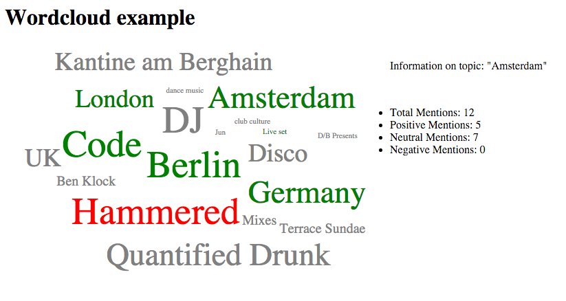

# WordCloud Example

An example word cloud that displays the topics in the topics.json file

## The challenge

The [**Wordcloud challenge**](https://gist.github.com/grahamscott/65b43572ad18c5fbdd87) is a test to read a json formatted file of topics and display them in a wordcloud.  

Each word shows the label of a topic sized by popularity.  
Topics are colored green for positive sentiment, grey for neutral and red for negative.  
The topic when clicked on displays a breakdown of sentiments.

## Installation

**To run the demo:**

* git clone the repository  
* install node
* npm install 
* npm start

**To run the tests:**  

* npm tests

## Dependencies and frameworks

The example was written using express.js to server the page.  
The wordcloud is rendered using the plugin [jqcloud](http://mistic100.github.io/jQCloud/index.html)

### Guide to the code

app.js routes the static files and a route to topics.json returns the json from the filestream. By limiting the amount of json returned, the server can deliver only the fields it needs to generate the wordcloud and show font size and sentiments. 

####Full topics.json

    {
    "topics": [
        {
            "id": "1751295897__Berlin",
            "label": "Berlin",
            "volume": 165,
            "type": "topic",
            "sentiment": {
                "negative": 3,
                "neutral": 133,
                "positive": 29
            },
            "sentimentScore": 65,
            "burst": 13,
            "days": [
                {
                    "date": "2014-06-06T00:00:00.000+0000",
                    "volume": 22
                },

####Compressed topics.json returned by app.js

           
    {
    "topics": [
            "label": "Berlin",
            "volume": 165,
            "sentiment": {
                "negative": 3,
                "neutral": 133,
                "positive": 29
            },
            "sentimentScore": 65,
                     

wordcloud-app.js calculates the popularity of each label from 1 to 6 based on the maximum value, finds the color for the word based on the sentiment and renders the wordcloud plugin. Each word is added with a click handler to responds to the click event and display the topic breakdown.
